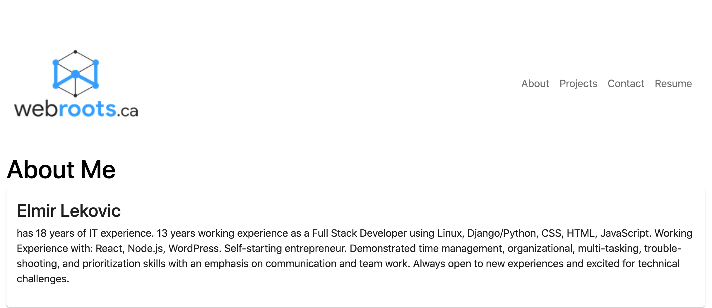

# lekas-profile-react

Technologies

Simple React Application of my portfolio

This application is mainly to showcase use of material-ui and carousel module.

Using the material-ui I setup the grid system, customized the theme and used the paper component to display cards.

The carousel module was used to display logos.

There are few features missing from this module:
 - setting how many images to show per page
 - transition timing

Future goal would be to customize the carousel module and achive these goals.

Overall using react I simplified the loadind of the pages and content.

The following image demonstrates the web application's appearance:

To view the working app use the link below:

https://lekas-redux.herokuapp.com/
